# Whatomate ERD Diagram

هذا الـ ERD يعكس **الخطة بعد تدقيق الواجهة الحية** لشاشة `/chat`.

التركيز الحالي لا يقتصر على chat core فقط، بل يشمل أيضاً:

- `user_notifications`
- `whatsapp_statuses`
- `chatbot_flows` كطبقة إعدادات مرتبطة بالـ data panels
- `custom_roles` + `permissions` بصيغة CRUD/read-only
- `user_contact_visibility_rules` لحصر رؤية جهات الاتصال والأرقام
- طبقة `quota/capacity` لحماية السيرفر من استنزاف slots أو التخزين أو الـ jobs

مع بقاء `Meta Cloud API` و`templates/widgets` خارج النطاق المؤكد.

```mermaid
erDiagram
    ORGANIZATION ||--|| ORGANIZATION_CONFIG : "has"
    ORGANIZATION ||--o{ ORGANIZATION_SLOT_ALLOCATION : "reserves"
    SLOT_INVENTORY ||--o{ ORGANIZATION_SLOT_ALLOCATION : "allocates"
    ORGANIZATION ||--o{ USER_ORGANIZATION : "links"
    USER ||--o{ USER_ORGANIZATION : "belongs_to"
    ORGANIZATION ||--o{ CUSTOM_ROLE : "defines"
    CUSTOM_ROLE ||--o{ ROLE_PERMISSION : "grants"
    PERMISSION ||--o{ ROLE_PERMISSION : "included_in"
    USER ||--o{ USER_CONTACT_VISIBILITY_RULE : "filters"
    ORGANIZATION ||--o{ USER_CONTACT_VISIBILITY_RULE : "scopes"

    ORGANIZATION ||--o{ TEAM : "has"
    TEAM ||--o{ TEAM_MEMBER : "contains"
    USER ||--o{ TEAM_MEMBER : "joins"
    USER ||--o{ USER_AVAILABILITY_LOG : "produces"
    ORGANIZATION ||--o{ USER_AVAILABILITY_LOG : "owns"
    USER ||--o{ USER_NOTIFICATION : "receives"
    ORGANIZATION ||--o{ USER_NOTIFICATION : "emits"

    ORGANIZATION ||--o{ API_KEY : "owns"
    ORGANIZATION ||--o{ SSO_PROVIDER : "configures"

    ORGANIZATION ||--o{ WHATSAPP_INSTANCE : "runs"
    WHATSAPP_INSTANCE ||--o{ INSTANCE_NOTIFICATION : "emits"
    WHATSAPP_INSTANCE ||--o{ WHATSAPP_STATUS : "publishes"
    USER ||--o{ WHATSAPP_STATUS : "creates"

    ORGANIZATION ||--o{ CONTACT : "has"
    USER ||--o{ CONTACT : "assigned_to"
    WHATSAPP_INSTANCE ||--o{ CONTACT : "receives_through"

    CONTACT ||--o{ MESSAGE : "contains"
    USER ||--o{ MESSAGE : "sends"
    MEDIA_ASSET ||--o{ MESSAGE : "attached_to"
    MESSAGE ||--o| MESSAGE : "replies_to"
    MEDIA_ASSET ||--o{ WHATSAPP_STATUS : "used_by"

    ORGANIZATION ||--o{ TAG : "defines"
    CONTACT ||--o{ CONTACT_COLLABORATOR : "shared_with"
    USER ||--o{ CONTACT_COLLABORATOR : "collaborates_on"
    CONTACT ||--o{ CONTACT_USER_DELETION : "hidden_for"
    USER ||--o{ CONTACT_USER_DELETION : "hides"

    CONTACT ||--o{ CONVERSATION_NOTE : "has"
    USER ||--o{ CONVERSATION_NOTE : "writes"
    CONTACT ||--o{ CHAT_CLOSURE_RATING : "rated_with"

    ORGANIZATION ||--o{ CANNED_RESPONSE : "defines"
    ORGANIZATION ||--o{ CHATBOT_FLOW : "stores"
    ORGANIZATION ||--o{ WEBHOOK : "broadcasts_to"
    ORGANIZATION ||--o{ CUSTOM_ACTION : "executes"

    LICENSE_RECORD ||--o{ LICENSE_EVENT : "logs"

    ORGANIZATION {
        uuid id PK
        text name
        text slug
        timestamptz deleted_at
    }

    ORGANIZATION_CONFIG {
        uuid id PK
        uuid organization_id FK
        int max_users
        int max_whatsapp_instances
        bigint storage_quota_bytes
        bigint storage_used_bytes
        text tenant_status
    }

    SLOT_INVENTORY {
        uuid id PK
        text resource_type
        int total_slots
        int reserved_slots
    }

    ORGANIZATION_SLOT_ALLOCATION {
        uuid id PK
        uuid organization_id FK
        uuid slot_inventory_id FK
        int allocated_slots
        int used_slots
    }

    USER {
        uuid id PK
        text email
        text availability_status
        jsonb settings
    }

    WHATSAPP_INSTANCE {
        uuid id PK
        uuid organization_id FK
        text jid
        text status
    }

    WHATSAPP_STATUS {
        uuid id PK
        uuid organization_id FK
        uuid instance_id FK
        uuid created_by_user_id FK
        timestamptz published_at
    }

    USER_NOTIFICATION {
        uuid id PK
        uuid organization_id FK
        uuid user_id FK
        text type
        boolean is_read
    }

    USER_CONTACT_VISIBILITY_RULE {
        uuid id PK
        uuid organization_id FK
        uuid user_id FK
        text scope_mode
        jsonb allowed_phone_numbers
    }

    CONTACT {
        uuid id PK
        uuid organization_id FK
        uuid instance_id FK
        text phone_number
        text status
        boolean is_public
    }

    MESSAGE {
        uuid id PK
        uuid organization_id FK
        uuid contact_id FK
        text direction
        text status
    }

    CHATBOT_FLOW {
        uuid id PK
        uuid organization_id FK
        text name
        text status
        jsonb panel_schema
    }

    WEBHOOK {
        uuid id PK
        uuid organization_id FK
        text target_url
        text subscribed_events
        jsonb custom_headers
    }
```

## Domain Notes

### Sidebar & Identity

الواجهة الحية أكدت وجود:

- org switcher
- availability status menu
- profile route
- theme and language settings

لذلك يبقى `organizations`, `user_organizations`, `users`, و`user_availability_logs` جزءاً فعالاً من المخطط التشغيلي.
في SaaS mode الافتراضي، المستخدم العميل سيملك غالباً org واحدة فقط، بينما org switcher يبقى مهماً للحسابات الداخلية أو المرتفعة الصلاحية.
اختيار اللغة نفسه يعتمد على ملفات `i18n JSON` في الواجهة، بينما قاعدة البيانات تحفظ `locale` فقط.

### Messaging Core

المحور الأساسي ما زال:

- `whatsapp_instances`
- `contacts`
- `messages`
- `media_assets`

لكن يجب أن يُقرأ الآن مع طبقات `notifications` و`statuses`.
`media_assets` أصبحت أيضاً حدّ المحاسبة الرئيسي للتخزين على مستوى المنظمة.

### Collaboration

التعاون البشري في المحادثات يتم عبر:

- `contact_collaborators`
- `conversation_notes`
- `tags`

وهذه الثلاثة ظهرت بوضوح داخل `Contact Info` و`Notes`.

### Access Control

- `custom_roles`
- `role_permissions`
- `user_contact_visibility_rules`

هذه الطبقة مطلوبة لأن الخطة الجديدة لم تعد تعتمد على صلاحية ثنائية فقط،
بل على CRUD/read-only مع مفاتيح مستقلة لـ unclaimed chat view/send
واستثناءات أرقام الهاتف.

### Adjacent Configuration

`chatbot_flows` عادت إلى الخطة كطبقة إعدادات مجاورة، لأن `Contact Info panel`
تعرض رسالة تربط عرض البيانات بـ `chatbot flow settings`.

### Capacity & Quotas

- `organization_configs` تخزن الحدود الأساسية مثل `max_users`, `max_whatsapp_instances`, `storage_quota_bytes`, و`tenant_status`.
- `slot_inventory` و`organization_slot_allocations` يشكلان طبقة الحجز المركزية للموارد المحدودة مثل slots الخاصة بالـ WhatsApp.
- حماية المنصة تعتمد على shared worker pool مع backpressure موجه لكل tenant بدل تخصيص worker مستقل لكل شركة.
